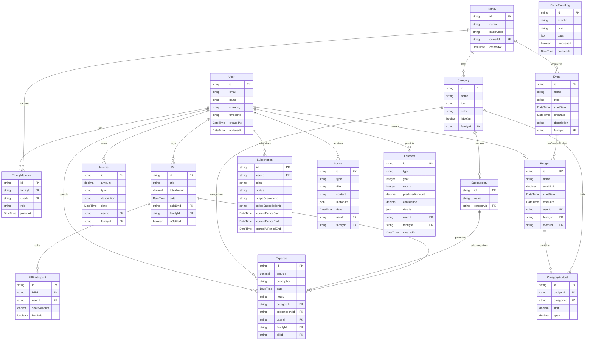

# تطبيق الميزانية الذكية

تطبيق شامل لإدارة الميزانية الشخصية والعائلية مع ميزات ذكية لتوفير المال والتخطيط المالي.

## نظرة عامة

تطبيق الميزانية الذكية هو حل متكامل يساعد الأفراد والعائلات على إدارة أموالهم بذكاء من خلال:

- **إدارة المصاريف والدخل**: تسجيل وتتبع جميع المعاملات المالية
- **التقارير الذكية**: تحليلات مفصلة مع تقارير PDF قابلة للتخصيص
- **الحساب العائلي**: إدارة مشتركة للميزانية مع عدة أفراد
- **تقنيات الذكاء الاصطناعي**: نصائح مالية ذكية وتوقعات مستقبلية
- **تقنية OCR**: استخراج البيانات من فواتير الشراء تلقائياً
- **الاشتراكات المدفوعة**: باقات متنوعة للمستخدمين الأفراد والعائلات

## المعمارية التقنية

### البنية الأساسية
- **Frontend**: Next.js 14 (App Router) + React + Tailwind CSS
- **Backend**: Next.js Route Handlers (src/app/api/*)
- **قاعدة البيانات**: Prisma ORM + SQLite (قابلة للترقية)
- **المدفوعات**: Stripe Integration
- **المصادقة**: NextAuth.js أو Session بسيطة
- **التحقق**: Zod Schema Validation

### خريطة المجلدات
```
src/
├── app/                    # Next.js App Router
│   ├── api/               # Route Handlers
│   │   ├── expenses/      # إدارة المصاريف
│   │   ├── incomes/       # إدارة الدخل
│   │   ├── reports/       # التقارير والـ PDF
│   │   ├── family/        # الحساب العائلي
│   │   ├── stripe/        # دفعات Stripe
│   │   └── ocr/          # معالجة الفواتير
│   ├── dashboard/         # لوحة التحكم
│   ├── add-expense/       # إضافة مصروف
│   └── camera-receipts/   # كاميرا الفواتير
├── server/                # منطق الخادم
│   ├── db.ts             # Prisma Client
│   ├── repositories/     # طبقة البيانات
│   ├── services/         # منطق الأعمال
│   └── pdf/              # قوالب PDF
├── components/           # مكونات React
└── utils/               # أدوات مساعدة
```

## المتطلبات الوظيفية

### 1. إدارة الاشتراكات والدفع (Stripe)
- **الباقات المتاحة**:
  - **الأساسية**: عائلة واحدة، حتى 4 أعضاء، تقارير محدودة
  - **المتقدمة**: عائلات متعددة، أعضاء غير محدودين، تقارير كاملة
- **العمليات المدعومة**:
  - إنشاء جلسة دفع (Checkout)
  - إدارة الاشتراك (Portal)
  - معالجة الـ Webhooks
  - مزامنة حالة الاشتراك

### 2. إدارة الميزانية والمصاريف
- **إدخال الدخل**: دخل أساسي وجانبي شهري
- **تسجيل المصاريف**: مبلغ، فئة، تاريخ، ملاحظات
- **فئات المصاريف**: فئات رئيسية وفرعية قابلة للتخصيص
- **حدود الميزانية**: تحديد حد أقصى لكل فئة
- **تنبيهات التجاوز**: تنبيه عند تجاوز 110% من الحد المسموح

### 3. التقارير الذكية وملفات PDF
#### أنواع التقارير:
- **الشهري**: ملخص شامل للشهر الحالي
- **السنوي**: تحليل اتجاهات 12 شهر
- **العائلي**: تقارير موحدة للعائلة
- **حسب الفئة**: تفصيل مصاريف فئة معينة
- **حسب العضو**: مساهمة كل فرد في العائلة

#### خصائص التقارير:
- مقارنة مع متوسط آخر 3 أشهر
- أفضل 5 فئات إنفاقاً
- نصائح توفير مخصصة
- دعم التقويم الهجري والميلادي
- تصدير PDF مع خيارات تخصيص

### 4. المناسبات والأحداث
- **أنواع المناسبات**: رمضان، عيد، مدارس، مخصص
- **التخطيط**: لسنة أو سنتين مقدماً
- **ميزانية المناسبة**: إنشاء ميزانية خاصة للحدث
- **التذكيرات**: تنبيهات قبل المناسبة

### 5. التوصيات المالية والادخار
- **تحليل النمط**: مقارنة المصاريف بالدخل
- **اقتراحات التوفير**: 
  - تقليل أكبر فئات الإنفاق
  - هدف ادخار 10-20% من الدخل
  - توصيات للأهداف طويلة المدى
- **نصائح يومية**: نصائح مخصصة حسب السلوك المالي

### 6. كاميرا الفواتير (OCR)
- **رفع الصور**: من الكاميرا أو المعرض
- **استخراج البيانات**: 
  - المبلغ الإجمالي
  - تاريخ الشراء
  - تقدير الفئة المناسبة
- **التحرير قبل الحفظ**: مراجعة البيانات المستخرجة
- **الحفظ التلقائي**: إنشاء مصروف جديد

### 7. الحساب العائلي
- **إنشاء العائلة**: كود دعوة فريد
- **الانضمام**: باستخدام كود الدعوة
- **إدارة الأعضاء**: إضافة وإزالة الأعضاء
- **ملخص العائلة**:
  - إجمالي مصاريف الشهر
  - توزيع حسب الفئات
  - مساهمة كل فرد
  - توصيات مشتركة

### 8. التقويم المزدوج (هجري/ميلادي)
- **الإدخال المزدوج**: اختيار أي من التقويمين
- **العرض الذكي**: تحويل تلقائي بين التقويمين
- **التقارير**: أسماء الشهور العربية في التقارير
- **التخطيط**: جدولة للـ 12 شهر القادمة

### 9. مراقبة الميزانية
- **المخطط مقابل الفعلي**: مقارنة بصرية
- **نظام الألوان**:
  - أحمر: تجاوز الميزانية
  - أخضر: ضمن الحد أو توفير
  - أصفر: اقتراب من الحد
- **المؤشرات**: نسب الإنفاق لكل فئة

### 10. تقسيم الفواتير (Split Bills)
- **التقسيم التلقائي**: حسب عدد المشاركين
- **التقسيم المخصص**: حصص مختلفة
- **تتبع الحالة**: من دفع ومن عليه دفع
- **التسجيل كمصروفات**: تحويل إلى مصاريف فردية

### 11. التنبؤ المالي الذكي
- **خوارزميات التنبؤ**:
  - المتوسط المتحرك (Moving Average)
  - التمهيد الأسي (Exponential Smoothing)
- **التوقعات**:
  - مصاريف الشهر القادم
  - احتياجات الادخار
  - نقاط الخطر المالي
- **التحديث التلقائي**: إعادة حساب شهرية

### 12. المساعد المالي (Chatbot)
- **الاستعلامات المدعومة**:
  - "كيف أوفر هذا الأسبوع؟"
  - "ما هي أكبر فئات الإنفاق؟"
  - "كم يمكنني ادخاره؟"
- **البيانات المعتمدة**: من قاعدة البيانات فقط
- **تحسين الصياغة**: باستخدام OpenAI (اختياري)

## مخطط قاعدة البيانات (ERD)



## متطلبات البيئة (.env.example)

```env
# قاعدة البيانات
DATABASE_URL="file:./prisma/dev.db"

# إعدادات التطبيق
APP_BASE_URL="http://localhost:3000"
NEXTAUTH_URL="http://localhost:3000"
NEXTAUTH_SECRET="your-secret-key-here"

# Stripe
STRIPE_SECRET_KEY="sk_test_..."
STRIPE_WEBHOOK_SECRET="whsec_..."
STRIPE_PRICE_BASIC="price_..."
STRIPE_PRICE_PRO="price_..."

# اختياري - للمساعد الذكي
OPENAI_API_KEY="sk-..."
```

## مرجع API

### المصاريف
- `GET /api/expenses` - جلب المصاريف
- `POST /api/expenses` - إضافة مصروف جديد
- `PUT /api/expenses/[id]` - تحديث مصروف
- `DELETE /api/expenses/[id]` - حذف مصروف

### الدخل
- `GET /api/incomes` - جلب الدخل
- `POST /api/incomes` - إضافة دخل جديد

### الفئات
- `GET /api/categories` - جلب الفئات
- `POST /api/categories` - إضافة فئة جديدة
- `GET /api/subcategories` - جلب الفئات الفرعية
- `POST /api/subcategories` - إضافة فئة فرعية

### الميزانيات
- `GET /api/budgets` - جلب الميزانيات
- `POST /api/budgets` - إنشاء ميزانية جديدة
- `GET /api/budgets/[id]/summary` - ملخص الميزانية

### التقارير
- `GET /api/reports/monthly?y=YYYY&m=MM&includeNotes=1&hideTables=0` - تقرير شهري
- `GET /api/reports/yearly?y=YYYY` - تقرير سنوي
- `GET /api/reports/family?familyId=...&y=YYYY&m=MM` - تقرير عائلي
- `GET /api/reports/category?categoryId=...&y=YYYY&m=MM` - تقرير فئة
- `GET /api/reports/member?memberId=...&y=YYYY&m=MM` - تقرير عضو
- `GET /api/reports/monthly/pdf?y=YYYY&m=MM&includeNotes=1&hideCharts=0` - PDF شهري

### المناسبات
- `GET /api/events` - جلب المناسبات
- `POST /api/events` - إضافة مناسبة جديدة

### العائلة
- `POST /api/family/create` - إنشاء عائلة جديدة
- `POST /api/family/join` - الانضمام لعائلة
- `GET /api/family/summary` - ملخص العائلة

### تقسيم الفواتير
- `POST /api/bills/split` - تقسيم فاتورة
- `GET /api/bills/[id]/status` - حالة الفاتورة

### التنبؤ
- `POST /api/forecast/run?y=YYYY&m=MM` - تشغيل التنبؤ
- `GET /api/forecast?y=YYYY&m=MM` - جلب التنبؤات

### النصائح
- `GET /api/advice/monthly?y=YYYY&m=MM` - نصائح الشهر
- `GET /api/advice/daily-latest` - آخر نصيحة يومية

### المساعد المالي
- `POST /api/assistant/ask` - سؤال المساعد

### كاميرا الفواتير (OCR)
- `POST /api/ocr/receipt` - معالجة فاتورة (FormData: file)

### Stripe
- `POST /api/stripe/checkout` - إنشاء جلسة دفع
- `POST /api/stripe/portal` - رابط إدارة الاشتراك
- `POST /api/stripe/webhook` - معالجة أحداث Stripe

### العروض (قادم)
- `GET /api/deals/search?region=...&q=...` - البحث عن عروض

## التقنيات المستخدمة

- **Framework**: Next.js 14 (App Router)
- **Database**: Prisma ORM + SQLite
- **Validation**: Zod
- **Dates**: date-fns
- **PDF Generation**: @react-pdf/renderer
- **OCR**: tesseract.js
- **Charts**: Recharts
- **Payments**: Stripe
- **Internationalization**: Intl API (Arabic/Islamic Calendar)
- **Styling**: Tailwind CSS
- **Components**: shadcn/ui

## التشغيل محلياً

### المتطلبات
- Node.js 18+
- npm أو yarn

### خطوات التشغيل

1. **نسخ المستودع**
```bash
git clone <repository-url>
cd budget-app
```

2. **تثبيت التبعيات**
```bash
npm install
```

3. **إعداد البيئة**
```bash
cp .env.example .env.local
# قم بتعديل المتغيرات في .env.local
```

4. **إعداد قاعدة البيانات**
```bash
npm run prisma:dev
npm run db:seed
```

5. **تشغيل التطبيق**
```bash
npm run dev
```

6. **فتح المتصفح**
```
http://localhost:3000
```

## سكربتات npm

```json
{
  "scripts": {
    "dev": "next dev",
    "build": "next build",
    "start": "next start",
    "prisma:dev": "prisma generate && prisma db push",
    "prisma:studio": "prisma studio",
    "db:seed": "node prisma/seed.js"
  }
}
```

## الاختبارات

### الاختبارات اليدوية
- ملف الاختبارات: `/docs/tests.http`
- مجموعة Postman: `/docs/api_collection.json`

### نقاط الاختبار الرئيسية
- ✅ تنبيه تجاوز الميزانية (110%)
- ✅ إنشاء PDF التقارير
- ✅ OCR استخراج بيانات الفواتير
- ✅ تقسيم الفواتير
- ✅ ملخص العائلة
- ✅ التنبؤ المالي
- ✅ النصائح اليومية المجدولة
- ✅ تدفق Stripe (Checkout/Portal/Webhook)

## الأمان والصلاحيات

### المصادقة
- جلسات مشفرة أو NextAuth
- حماية كلمة مرور قوية
- انتهاء صلاحية الجلسة

### صلاحيات البيانات
- عزل بيانات العائلات
- صلاحيات حسب دور العضو
- تشفير البيانات الحساسة

### حماية API
- معدل الطلبات (Rate Limiting)
- التحقق من المدخلات (Zod)
- تسجيل الأخطاء الأمنية

## النشر

### Vercel (موصى به)
```bash
# ربط المشروع
vercel link

# نشر للإنتاج
vercel --prod
```

### إعداد Cron Jobs (Vercel)
```json
{
  "crons": [
    {
      "path": "/api/cron/daily-tips",
      "schedule": "0 8 * * *"
    }
  ]
}
```

### متغيرات البيئة للإنتاج
- تأكد من تحديث `DATABASE_URL` لقاعدة بيانات الإنتاج
- استخدم مفاتيح Stripe الحقيقية
- قم بتحديث `APP_BASE_URL` للدومين الجديد

## خارطة الطريق المستقبلية

### الإصدار 1.1
- [ ] تطبيق الجوال (React Native)
- [ ] إشعارات فورية
- [ ] تكامل مع البنوك
- [ ] تحليلات متقدمة

### الإصدار 1.2
- [ ] الذكاء الاصطناعي المتقدم
- [ ] توصيات الاستثمار
- [ ] أهداف الادخار التفاعلية
- [ ] التقارير التفاعلية

### الإصدار 2.0
- [ ] نظام محاسبة كامل
- [ ] إدارة الفواتير التلقائية
- [ ] تكامل عالمي للعملات
- [ ] منصة تجارية للمستشارين

## الدعم والمساهمة

### الحصول على المساعدة
- 📧 Email: support@budgetapp.com
- 📚 Documentation: [docs.budgetapp.com](https://docs.budgetapp.com)
- 💬 Discord: [discord.gg/budgetapp](https://discord.gg/budgetapp)

### المساهمة
1. Fork المشروع
2. أنشئ branch للميزة الجديدة
3. اكتب الكود مع الاختبارات
4. افتح Pull Request

## الترخيص

هذا المشروع محمي بترخيص MIT. راجع ملف `LICENSE` لمزيد من التفاصيل.

---

**تم تطوير هذا التطبيق بـ ❤️ من قبل Abdullah Alawiss**
